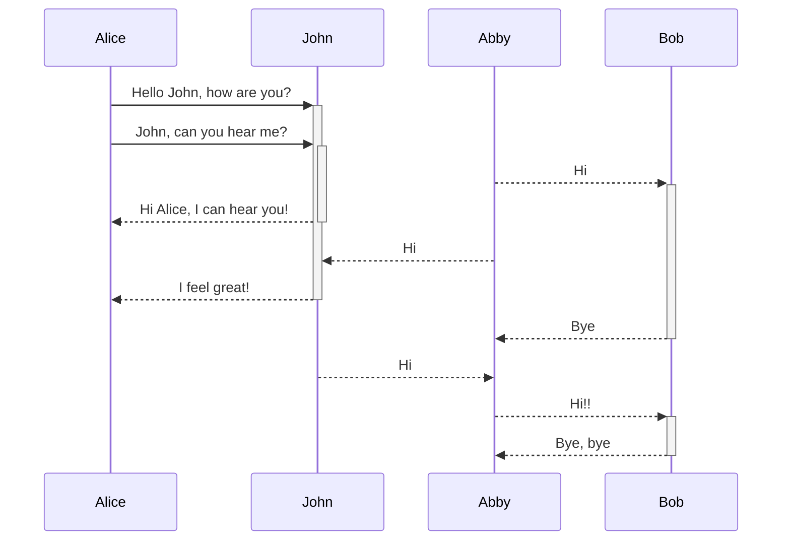

---
tags:
  - Obsidian
date: 2024-08-04
---

## Mermaid




## Shell script

```sh
cd ~/workspace/quartz;npx quartz sync
```

## Python

```python
def say_hello_to(name):
	print(f'Hello, {name}')
```